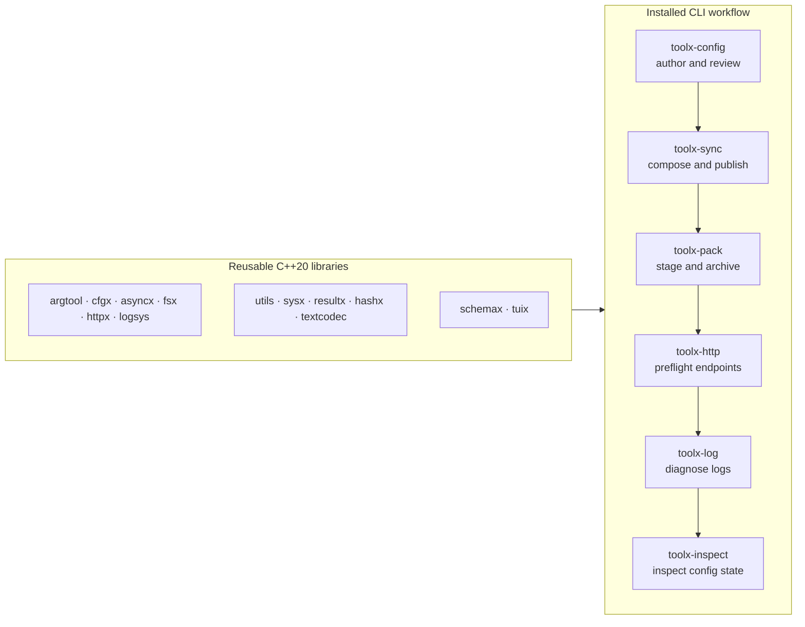

# ToolX C++ Toolkit

ToolX is a C++20 toolkit for building small operational tools without first
assembling a framework. It provides focused libraries for command-line parsing,
configuration, concurrency, filesystem transactions, HTTP, logging, terminal
rendering, schemas, codecs, hashes, and platform utilities. Six installable CLIs
compose those libraries into a practical release workflow.

> Status: Released
> Applies to: v0.3.2
> Latest release: v0.3.2

This release preserves the public `0.3.x` source-compatibility boundary while
hardening filesystem transactions, HTTP requests, pack staging and release gates.

## Understand ToolX in one minute

ToolX has two public surfaces:

1. **Thirteen CMake library targets** for applications that want individual
   capabilities.
2. **Six product CLIs** for operators and release automation.



The CLI arrows describe an operator journey, not runtime dependencies: each
tool can be installed and invoked independently.

## Choose your path

### Five-minute path: use the product CLIs

```bash
cmake --preset dev
cmake --build --preset dev

build/dev/toolx-config doctor --file app.json --require svc.host --expect svc.port=int --json
build/dev/toolx-sync --base app.json --out resolved.json --dry-run --json
```

On multi-config generators, executables may be under a configuration directory.
The complete command contracts are indexed in [CLI documentation](docs/cli/).

### Five-minute path: consume the C++ libraries

After installing ToolX, use its exported CMake targets:

```cmake
find_package(ToolX CONFIG REQUIRED)

add_executable(my_tool main.cpp)
target_link_libraries(my_tool PRIVATE toolx::argtool toolx::cfgx toolx::logsys)
```

The standalone consumer in
[`examples/install_consumer`](examples/install_consumer) verifies the installed
package shape. Start with the [module guides](docs/modules/) before consulting
headers directly.

### Five-minute path: explore working examples

Every public module has a focused cookbook. Together the 13 cookbooks contain
59 annotated, offline-friendly scenarios. A reproducible product-chain showcase
then drives all six installed CLIs against fixed fixtures and a loopback HTTP
server.

See the [showcase guide](docs/examples/showcase.md) for commands, captured output,
side effects, and platform notes.

## Current capability map

| Area | Targets | Status | What it provides |
| --- | --- | --- | --- |
| CLI and configuration | `argtool`, `cfgx` | Stable core | Typed arguments, constraints, structured config, layering, validation, reload and snapshots |
| Runtime orchestration | `asyncx`, `fsx`, `logsys` | Stable core | Tasks, scheduling, transactional file work, archives, structured logs, spans and metrics |
| Platform support | `utils`, `sysx`, `resultx`, `hashx`, `textcodec` | Stable support | Common helpers, platform wrappers, result adapters, non-cryptographic hashes and codecs |
| Networking | `httpx` | Bounded stable | HTTP client, retry, redirects, proxy control, circuit breaker, upload/download and optional TLS |
| Structured validation | `schemax` | Experimental MVP | A deliberately small schema layer on top of `cfgx` |
| Terminal UI | `tuix` | Experimental foundation | Styled frames, layouts, input, widgets and deterministic rendering primitives |

The normative classification and compatibility promises live in
[Stability](docs/stability.md).

## Product workflow

| CLI | Primary job | Typical inputs | Writes business output? |
| --- | --- | --- | --- |
| `toolx-config` | Inspect, edit, merge, validate and snapshot configuration | Config files and optional schema | Only for explicit editing/merge/snapshot commands |
| `toolx-sync` | Compose base, remote and overlay layers, then publish atomically | Config layers, optional URL/schema | Yes, unless `--dry-run` |
| `toolx-pack` | Stage a release tree and create deterministic tar archives | Source tree or manifest | Yes, unless `plan`/`--dry-run` |
| `toolx-http` | Gate simple HTTP endpoint expectations | URL or manifest | Only an optional audit log |
| `toolx-log` | Summarize existing logsys text/JSONL files | Log files or manifest | Only an optional audit log |
| `toolx-inspect` | Report or render config/schema state | Config, schema or manifest | Only an optional audit log |

Exit codes, JSON envelopes, precedence, side effects, and implicit behavior are
compared in the [cross-CLI matrix](docs/cli/matrix.md).

## Build and compatibility snapshot

- CMake 3.20 or newer and a C++20 compiler are required; presets need CMake 3.21 or newer.
- CI verifies current Linux GCC, Linux Clang, Windows MSVC, and macOS Clang
  environments. ToolX does not infer older minimum compiler versions from that
  matrix.
- Default builds do not require a third-party runtime library.
- `httpx` can be built with OpenSSL or mbedTLS; the backends are mutually
  exclusive and disabled in the default release package.
- Enabling tests fetches pinned GoogleTest 1.14.0. Consumers do not inherit that
  dependency.
- ToolX promises documented source compatibility within `0.3.x`, not ABI
  compatibility across compilers, standard libraries, or build configurations.

See [Build and compatibility](docs/build-and-compatibility.md) and
[Dependencies](docs/dependencies.md) before choosing a TLS or test configuration.

## What changed in `v0.3.2`

- `toolx-http` and `toolx-sync` expose deterministic opt-out from environment
  proxy routing; OpenSSL loopback tests cover trust and hostname validation.
- Filesystem tree operations enforce path boundaries, and FSXJ3 journals recover
  new copy parents and preserve conflicts after interruption.
- HTTP validates request framing and metadata, resolves relative redirects, and
  bounds multipart collision work.
- Pack staging rejects overlapping roots, preserves replacements and literal POSIX
  names, and reports incomplete enumeration.
- Release metadata, source archives, coverage artifacts, clang-tidy, sanitizers and
  fuzz smoke runs are enforced by automated checks.

User-visible history is maintained in [CHANGELOG.md](CHANGELOG.md); detailed
release notes are in [the v0.3.2 release notes](docs/releases/v0.3.2.md).

## Repository map

| Path | Responsibility |
| --- | --- |
| `include/`, `src/` | Public headers and library implementations |
| `tools/` | Six installed product CLI entry points |
| `examples/` | Module cookbooks, integrations, benchmarks and showcase fixtures |
| `tests/`, `cmake/` | Unit/integration/contract checks and release verification |
| `docs/modules/` | Curated module guides and API matrices |
| `docs/cli/` | CLI references and cross-product contracts |
| `docs/examples/` | Reproducible reports and learning routes |
| `docs/development/` | Chinese maintainer notes, audits, designs and retrospectives |

The complete reading order begins at the [documentation portal](docs/index.md).
The active direction is recorded in the [roadmap](docs/roadmap.md).

## Explicit non-goals

ToolX is not a package manager, deployment platform, secret manager, complete
JSON Schema implementation, monitoring system, `curl` replacement, or general
TUI framework. New products are admitted only after a concrete workflow and a
tested compatibility contract exist.

## License

ToolX is available under the [MIT License](LICENSE).
