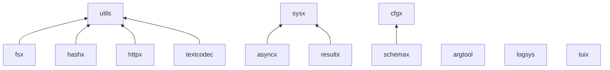
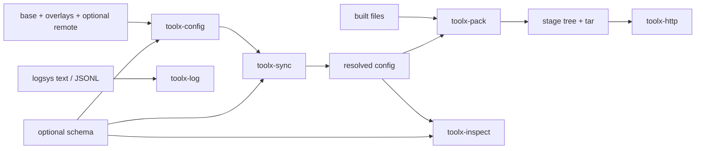

# ToolX Architecture

> Audience: C++ consumers, CLI integrators, and maintainers
> Status: Canonical architecture guide
> Applies to: `v0.3.2` release candidate
> Source of truth for: module dependencies and product composition

## Design shape

ToolX keeps public libraries independently consumable and builds product CLIs
by composition. Libraries never depend on `tools/`; product code may combine
multiple libraries when the workflow requires it.

The repository exports 13 CMake targets. Twelve have compiled implementations;
`resultx` is an interface target containing inline cross-module adapters.

## Library dependency graph

The graph reflects public CMake link edges. On Windows, `sysx`, `httpx`, and
`logsys` also link the system `ws2_32` library. Optional OpenSSL or mbedTLS
targets become public dependencies of `httpx` when selected.

`resultx.h` includes adapters for `asyncx`, `cfgx`, `fsx`, and `httpx`. A
consumer must link the underlying module target for every adapter it actually
uses; linking `toolx::resultx` alone only supplies its declared `sysx` edge.

## Module layers

| Layer | Modules | Responsibility |
| --- | --- | --- |
| Platform and primitives | `utils`, `sysx`, `hashx`, `textcodec` | Small deterministic helpers and platform normalization |
| Error adaptation | `resultx` | Translate existing module status/result types at integration boundaries |
| Application core | `argtool`, `cfgx`, `asyncx`, `fsx`, `logsys` | CLI, configuration, execution, filesystem and diagnostics |
| Bounded networking | `httpx` | HTTP workflows with explicitly selected TLS behavior |
| Experimental surfaces | `schemax`, `tuix` | Schema subset and terminal application building blocks |

## CLI composition

| CLI | Composed libraries |
| --- | --- |
| `toolx-config` | `argtool`, `cfgx`, `schemax` |
| `toolx-sync` | `argtool`, `asyncx`, `cfgx`, `fsx`, `httpx`, `logsys`, `schemax` |
| `toolx-pack` | `argtool`, `cfgx`, `fsx`, `logsys`, `schemax` |
| `toolx-http` | `argtool`, `cfgx`, `httpx`, `logsys`, `schemax` |
| `toolx-log` | `argtool`, `cfgx`, `logsys`, `schemax` |
| `toolx-inspect` | `argtool`, `cfgx`, `logsys`, `schemax`, `tuix` |

No CLI introduces a corresponding public `*x` library merely to share private
product code. Reuse pressure must first be proven across products.

## Operator journey

This is a product narrative, not an enforced pipeline. `toolx-http`,
`toolx-log`, and `toolx-inspect` are independent read/diagnostic tools.

## Data and side-effect boundaries

- `cfgx::Node` is the shared structured-data model used by schema and several
  CLI envelopes.
- `fsx::BatchPlan` owns filesystem mutation planning and optional recovery
  journals; tools should not duplicate its transactional behavior.
- `httpx::Client` owns HTTP policy such as retries, redirects, proxy lookup and
  TLS configuration. Network access occurs only from explicit request flows.
- `logsys::Logger` is process-global by design; scoped context and explicit
  flushing bound common tool workflows.
- CLI `--json` changes rendering, not side effects. The cross-CLI matrix is the
  authoritative place to check writes and precedence.

## Compatibility boundaries

Stable module APIs are source-compatible within the documented `0.3.x` line.
`schemax` and `tuix` do not carry that full promise. Product CLI envelopes are
separate from library status types and remain additive-only where documented.

See [Stability](stability.md), [Dependencies](dependencies.md), and the
[cross-CLI matrix](cli/matrix.md) for normative details.
