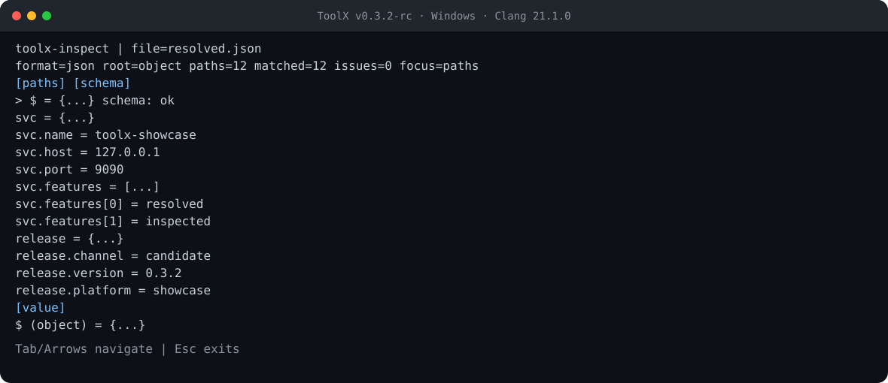

# Reproducible Product-Chain Showcase

> Audience: CLI users, release reviewers, and maintainers
> Status: Verified executable report
> Applies to: `v0.3.2` release candidate
> Source of truth for: the config → sync → pack → HTTP → log → inspect demonstration

This report is backed by `examples/product_chain_showcase`. The runner creates
an isolated copy of fixed fixtures, invokes all six CLIs in product order, and
retains every output when a step fails.

## Run it

Configure and build with tools and examples enabled, then choose the runner for
the host platform:

```powershell
cmake -S . -B build/showcase -G Ninja `
  -DTOOLX_BUILD_TESTS=OFF -DTOOLX_BUILD_TOOLS=ON -DTOOLX_BUILD_EXAMPLES=ON
cmake --build build/showcase
./examples/product_chain_showcase/run.ps1 `
  -BinDir ./build/showcase -OutputDir ./build/showcase/product-chain
```

```bash
cmake -S . -B build/showcase -G Ninja \
  -DTOOLX_BUILD_TESTS=OFF -DTOOLX_BUILD_TOOLS=ON -DTOOLX_BUILD_EXAMPLES=ON
cmake --build build/showcase
bash ./examples/product_chain_showcase/run.sh \
  ./build/showcase ./build/showcase/product-chain
```

Both scripts reject the repository root, filesystem root and binary directory
as output targets. An existing output directory is cleaned only when it contains
the runner-created `.toolx-showcase-output` marker, preventing an unrelated
directory from being erased by a mistyped argument. The loopback server is
terminated on success or failure.

## Chain and contracts

| Step | Command | Input | Durable output | Observed contract |
| ---: | --- | --- | --- | --- |
| 1 | `toolx-config merge` | base + local JSON | `merged.json` | `toolx.config.result`, merge succeeds |
| 2 | `toolx-config doctor` | merged JSON + schema | JSON capture | schema and required/typed paths pass |
| 3 | `toolx-sync` | merged JSON + schema | resolved config, snapshot, journal, log | two atomic-write steps published |
| 4 | `toolx-pack stage` | two package fixture files | stage tree + tar | two entries, 137 bytes, tar capability true |
| 5 | `toolx-http check` | loopback health URL | JSON capture | HTTP 200 and body contains `ready` |
| 6 | `toolx-log summarize` | three fixed log lines | JSON capture | three parsed, two warning-or-higher matches |
| 7 | `toolx-inspect report/render` | resolved JSON + schema | report JSON + terminal frame | 12 paths, 0 schema issues |

The server binds an ephemeral port on `127.0.0.1`, writes it to
`showcase.port`, and serves one `/health` request. `toolx-http` is always called
with `--no-proxy-from-env`; no DNS lookup or external network endpoint is part
of the workflow. `toolx-sync` receives no remote URL.

## Selected real output

The following values were captured on 2026-07-30 from the checked-in fixtures.
Only machine-specific output-root prefixes and the ephemeral port are shown as
`$OUT` and `$PORT` below.

```text
toolx-config merge:  ok=true  schema=toolx.config.result  append_arrays=false
toolx-sync:          ok=true  message=published  steps=2  schema_issues=[]
toolx-pack:          ok=true  entries=2  bytes=137  archive_format=tar
toolx-http:          ok=true  url=http://127.0.0.1:$PORT/health  status=200
toolx-log:           ok=true  parsed=3  matched=2  warning=1  error=1
toolx-inspect:       ok=true  paths=12  schema_issue_count=0
```

Resolved configuration:

```json
{
  "svc": {
    "name": "toolx-showcase",
    "host": "127.0.0.1",
    "port": 9090,
    "features": ["resolved", "inspected"]
  },
  "release": {
    "channel": "candidate",
    "version": "0.3.2",
    "platform": "showcase"
  }
}
```

## Artifact tree

```text
product-chain/
├── .toolx-showcase-output
├── 01-config-merge.json       ├── merged.json
├── 02-config-doctor.json      ├── resolved.json
├── 03-sync.json               ├── snapshot.json
├── 04-pack.json               ├── resolved.journal
├── 05-http.json               ├── sync.log
├── 06-log.json                ├── stage/
├── 07-inspect.json            │   ├── README.md
├── 08-inspect-frame.txt       │   └── bin/tool.txt
├── input/                     ├── toolx-showcase.tar
│   ├── app.base.json          └── showcase.port
│   ├── app.local.json
│   ├── app.log
│   ├── schema.json
│   └── package-src/
└── artifacts.txt
```

Each captured command also has a `.stderr` sibling. Successful verified runs
leave those files empty; failed runs preserve them for diagnosis.

## Terminal frame

Exact text: [`docs/assets/showcase/toolx-inspect-frame.txt`](../assets/showcase/toolx-inspect-frame.txt).



Capture metadata: ToolX `v0.3.2` release candidate; Windows; Clang 21.1.0;
`toolx-inspect render --file resolved.json --schema input/schema.json --width 90 --height 18`.

## Reproducibility boundaries

- The port number and elapsed milliseconds vary by run.
- Absolute paths in JSON envelopes vary by output directory.
- `sysx`/compiler labels in independent cookbooks describe the host build.
- The runner does not modify tracked fixtures; compare with
  `git diff -- examples/product_chain_showcase/fixtures` after a run.
- A successful product chain demonstrates the CLI composition path. It does
  not replace the existing unit, integration, contract and release-smoke CI.
